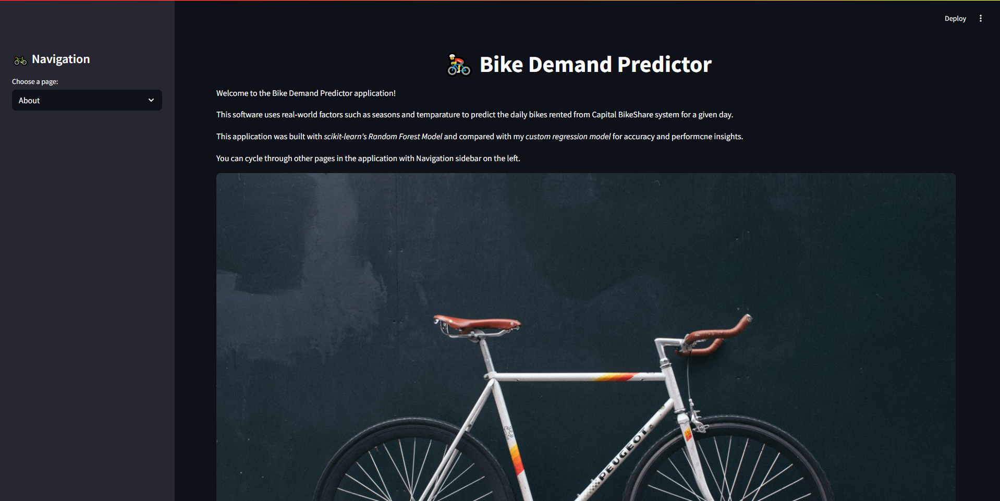
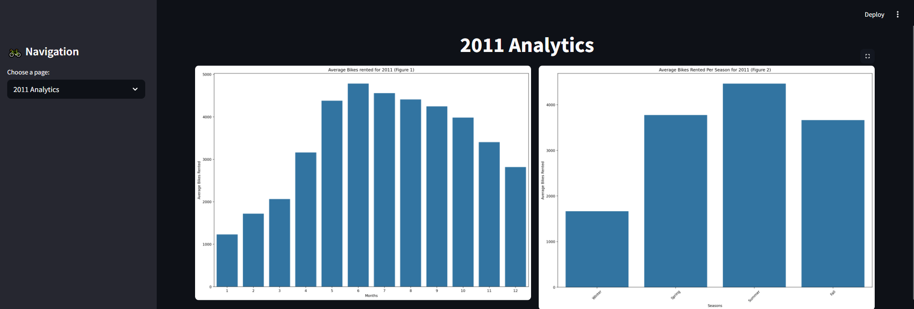
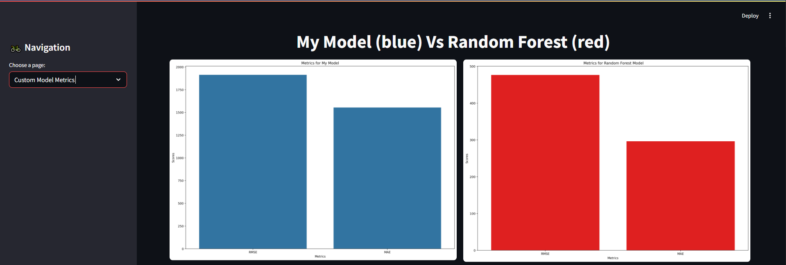

# 🚲 Bike Sharing Demand Prediction with Custom Regression Model

This project explores the prediction of bike rental counts using regression techniques, including a fully custom-built regression model. The goal is to analyze key features influencing bike usage and evaluate the performance of different models. A Streamlit application is also included to showcase exploratory data analysis (EDA) insights and interactive model comparisons.

---

## 📊 Dataset

- **Source**: [Bike Sharing - UCI Machine Learning Repository](https://archive.ics.uci.edu/ml/datasets/bike+sharing+dataset)
- The dataset includes daily records of rental bikes in the Capital Bikeshare system, along with associated weather and seasonal data.

---

## 🧠 Problem Definition

**Objective**:  
Predict the total rental count of bikes using features such as weather conditions, time, and seasonality. Identify the most influential features and compare model performance.

---

## 🛠️ Features of this project

### ✅ Custom Regression Model
- Built entirely from scratch using Python
- Implements custom versions of the following metrics:
  - Mean Squared Error (MSE)
  - Root Mean Squared Error (RMSE)
  - Mean Absolute Error (MAE)
  - R² Score (Coefficient of Determination)

### 🧪 Model Evaluation & Benchmarking
- Models evaluated:
  - Custom Regression Model
  - Scikit-learn Linear Regression
  - Scikit-learn Decision Tree Regressor
  - Scikit-learn Random Forest Regressor
- Evaluation performed using both custom and scikit-learn metrics

### 🔍 Exploratory Data Analysis (EDA)
- Seasonal, temporal, and weather-based trends visualized
- Correlation heatmaps and boxplots
- Insights displayed in the Streamlit dashboard

### ⚙️ Hyperparameter Tuning
- Includes a script to tune the learning rate of the custom regression model
- Provides results to identify optimal learning configurations

### 🌐 Deployment
- Deployed with Streamlit
- Interactive app to:
  - Compare model performance
  - Display EDA findings
  - Display Feature Importance values
  - Select and view model predictions

---
### Dataset Citation
- Fanaee-T, H. (2013). Bike Sharing [Dataset]. UCI Machine Learning Repository. https://doi.org/10.24432/C5W894.
---
### Future enhancements to custom regression model
- Normal equation implementation
- Lasso and Ridge regression options
- Stochastic and Mini-batch Gradient-descent variations
---

## 📂 Repository Structure

├── Bike_Data_EDA.ipynb # Exploratory Data Analysis of bike share data  
├── BikeShare_Model_Train_Eval.ipynb # Model training and evaluation notebook  
└── Model_test.ipynb # AModel testing experiments for my regression model
---
## 🖼️ Streamlit App Preview

### 📊 Dashboard Overview

### 📈 EDA Example

### 🤖 Model Comparison

